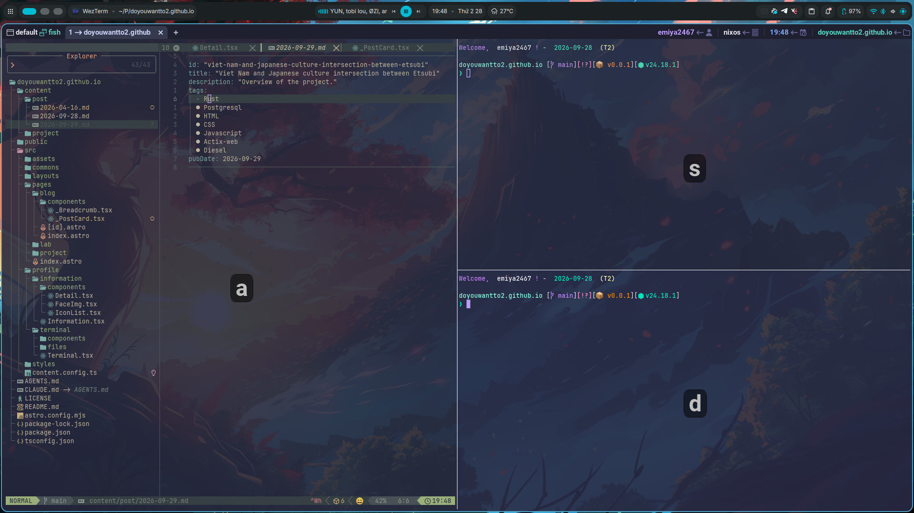
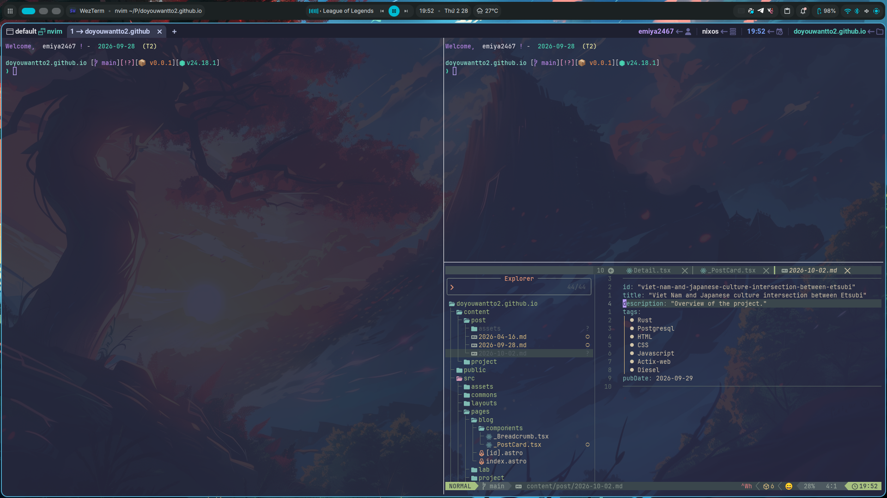

# Integrating Neovim into NixOS

In an environment where almost everything is declarative like NixOS, running binary files is not always straightforward. I usually have to explicitly declare the package or configure the system to allow them to run.

It might sound a little annoying, but in return I can keep control over my environment. Packages are managed by NixOS, so I do not have to remember which version I installed, where I installed it, or how to remove it later.

## NixOS and Neovim

A good example of this is LSP. When using LazyVim, the common approach is to install LSPs through Mason. However, with NixOS, I feel like this wastes some of what Nix can do. So the first thing I did was disable Mason and let NixOS manage all the packages that Neovim needs.

Nix works in a declarative way, so I try to keep my entire Neovim configuration the same way. If I move to another machine or have to reinstall my system, I only need to bring my configuration with me and let Nix handle the rest.

Here I use LazyVim and have modified some parts of the configuration to fit my workflow.

I currently use Neovim almost every day. At first, it was just a text editor, but after spending some time configuring it, it has become a personalized IDE made specifically for me. I have LSPs, formatters, debuggers, and almost everything I need for coding directly inside Neovim.

## WezTerm

Another important part of my workflow is the terminal emulator. I currently use WezTerm by Wez Furlong. It can be configured with Lua and is written in Rust, so its performance is quite good.

I usually use WezTerm together with Neovim and split the terminal into multiple panes when working. It also supports SSH, so I can keep almost the same workflow when working on another machine.

This is what it looks like after I swap the position of the panes using the `d` key.

## My experience

I have been using WezTerm + Neovim for more than a year, and overall I am quite happy with this workflow.

I rarely run into any serious problems. Most of the problems I encounter are related to missing dependencies or packages that have not been declared in NixOS rather than Neovim or WezTerm themselves.

Of course, setting everything up like this is not easy either. The most time-consuming part is still reading the documentation and writing the Lua configuration for Neovim.

But once everything is configured, I have a fairly stable development environment where I can control almost every part of my workflow.
