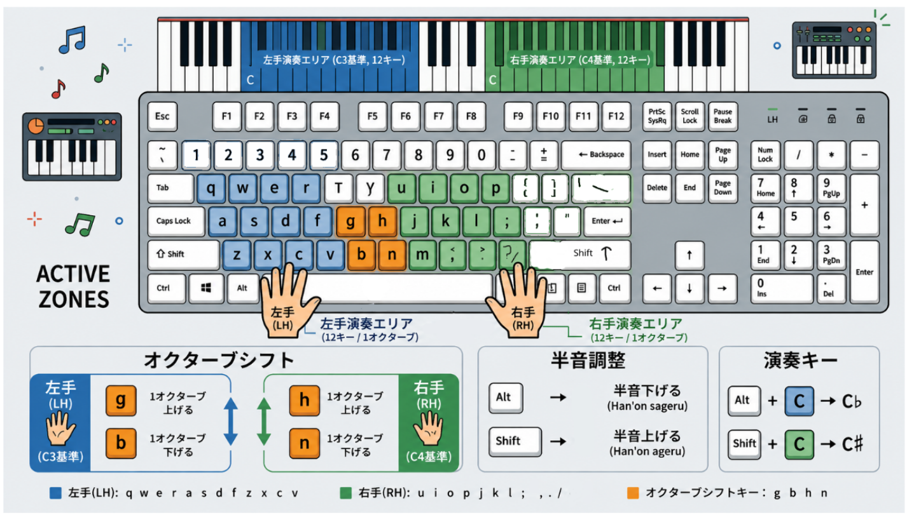

First off, this is a project that's mostly vibe-coded.

That said, this isn't a project I'm doing just for fun (at least not entirely), nor is it one where I let AI do everything from start to finish. This is a project I'm pretty serious about.

## Why I built this app

Back when my family couldn't afford a piano, I turned to [Everyone Piano](https://www.everyonepiano.com/) to play. But one problem I ran into with Everyone Piano was that without a keyboard with a numpad, you can't play a song to its full extent. This is a big inconvenience on a laptop — to play well you have to memorize the exact position of every key, and when you're in an environment where you can't see the keyboard, I wanted to be able to play through touch typing instead, which would be far more convenient.

That's when a question popped into my head: what if blind people don't have a piano?

## Early challenges

Of course, it comes with no shortage of challenges. I know a bit of music theory but I'd never actually touched a real piano, so a lot of the time, even though I'd absorbed the knowledge, it was hard to put it to use since I didn't have the conditions to practice.

First, I decided the project had to be split into two phases. Phase one was to see whether it was even feasible (this one), and phase two was to figure out what to do with it.

## Phase 1: Proving feasibility

I'd been working in C quite a lot, but after dealing with memory leaks one too many times, I decided to move to Rust — and honestly, I haven't looked back since.

My initial goal was to build a CLI app to test whether it could run at all — I used [ratatui](https://ratatui.rs/). Later, because of debugging issues, I switched it over to Tauri.

Of course, I didn't know anything about FE or frameworks. And the most popular framework, React, uses a virtual DOM — running on it would be like shooting myself in the foot — so I picked SolidJS as the most sensible choice to optimize performance when pushing audio through I/O. Instead of using a virtual DOM, SolidJS runs directly on the DOM and runs only once instead of having to update the DOM tree like React or other frameworks.

After picking SolidJS, I basically let AI write the entire UI. Honestly, building effects or APIs wasn't a problem anymore, since Tauri uses a frontend–backend model rather than the hybrid approach of Electron, so each part stays in its own lane — pretty convenient.

## Phase 2: Going deep into the backend

But down in the backend, things get much more complicated. I ran into three main problems.

**The first problem was audio files.** Most of them use soundfont or sfz, but those are C libraries specific to certain software, and some aren't even open source. I solved it by using samples from [sfzinstruments](https://github.com/sfzinstruments) and learning how their format standard works to understand the principle behind it. Actually, sfz is just a text file, but it's used to map audio to the corresponding signal when one is received. Especially with piano emulator software, from what I found, it's pretty common, so leveraging sfz and sfzinstruments' samples could be seen as something I needed to prioritize.

**The second problem was file decompression.** WAV and FLAC are two different audio formats. WAV is uncompressed, while FLAC is compressed. During playback, FLAC gets decompressed and stored in RAM, which saves a lot of memory. But that's the current obstacle — the file doesn't have enough notes with the corresponding accents since some got compressed. To solve it, I used a JSON file to store the position of each file, accepting that some notes might end up playing the same FLAC file. Initially I planned to write a decompression algorithm and load it into RAM, but honestly I could only load the FLAC file into RAM because it was just too hard. It would've been no different from rewriting the entire source code of a sampler.

**The third problem was integrating MIDI files to display notes.** The core was basically done, but for the app to be appealing enough it needed an autoplay mode. That's when I had to ask University of Youtube to teach me how MIDI files work and integrate it so it looks like those piano tutorial videos with the pretty raindrops effect.

## Result

After untangling all that mess, my app can be said to run pretty smoothly. You can check out the YouTube video below for a clearer look:

https://www.youtube.com/watch?v=eoPtckVYc3c

Here's an image describing the play rules — it works just like playing piano with two hands, every play zone revolves around the ten-finger typing motion.

## The name

In the end, I named the project Rakund. That is, Raku in Japanese (joy) and nd from Grand Piano, combined. It means "piano of joy."

## The future

Right now I don't plan to keep working on it since I'm in the middle of designing the next project based on this with clearer goals, especially around the overhead of running through IPC and whether to use WebAssembly instead of a native desktop app. Anyway, these are things still brewing in my head.

That said, I'm not abandoning the bigger picture. One thing I still want to do is support blind users by getting the word out about this project — because the more people know about it, the more likely it is to reach blind people who could actually use it.

[Github](https://github.com/doyouwantto2/rakund)
